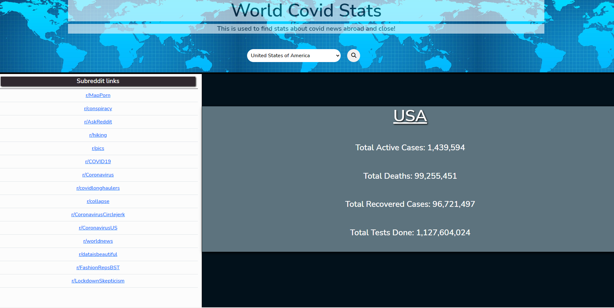
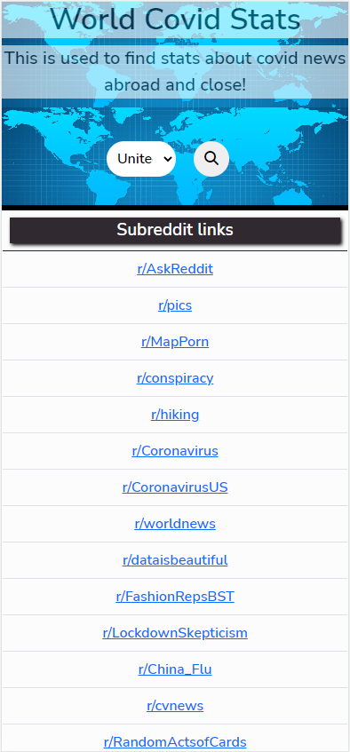
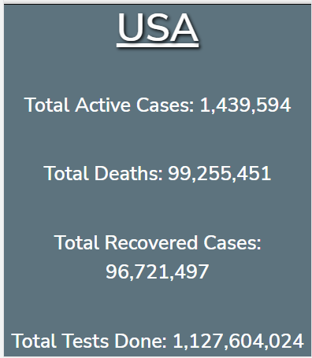

# Covid-Tracker
## Description
Covid Tracker uses two third party APIs to search for data based on a selected Country. The Reddit API will pull up to 15 subreddits regarding Covid related articles for that Country. The COVID19 API will pull current COVID Statistics for that country.  

## Access

<!-- Deployed weblink-->

The Covid Tracker webpage can be accessed at the following URL...

https://eaponte24.github.io/Covid-Tracker/

The URL of the GitHub repository ...

https://github.com/Eaponte24/Covid-Tracker

## Visuals

<!-- Provide the visuals for full display and phone display -->
This is how the Covid Tracker website will look on a full display computer screen.

This is how the deployed Covid Tracker website will look on a cell phone.

## Usage
- When a user opens the Covid Tracker website a search bar is available.
  - Use the drop down list in th search bar to select a country.
  - Click the search icon.

- Up to 15 Subreddits will display regarding Covid related articles for that Country. 
    - Each subreddit is a hyperlink to route the user to that article. 
   
- Covid Statistics for that Country will display...
    - Total Active Cases
    - Total Deaths
    - Total Recovered Cases
    - Total Tests Done

- Each Country that is searched will be saved to local storage.
  
_Here you will see a demonstration on how the Covid Tracker website works._

## Support
For help with this webpage please contact
|Name | Email |
|-----------|---------------------------|
|Lynn Sadler| lynnadelesadler@yahoo.com |
|Ricky Aponte|Rickyapontephotography@gmail.com |
|John Ifert| john.ifert.miller@gmail.com |

## Roadmap
Check back to this page as enhancements could be made for usability and optimized display.

## Authors and acknowledgment

Sourcecode credit to be given to Ricky Aponte , John Ifert and Lynn Sadler.

Acknowledgement to Uconn Full Stack Web Developer Bootcamp, Teachers and Teacher assistants for the support. 

Acknowledgment to third party API's from Reddit and COVID19 for providing the data we are searching for. 

## License
N/A